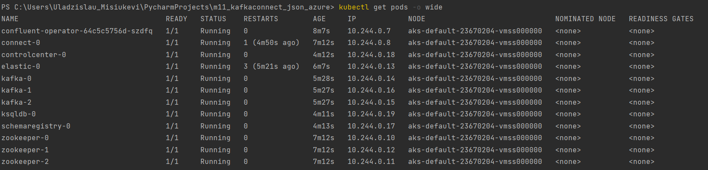
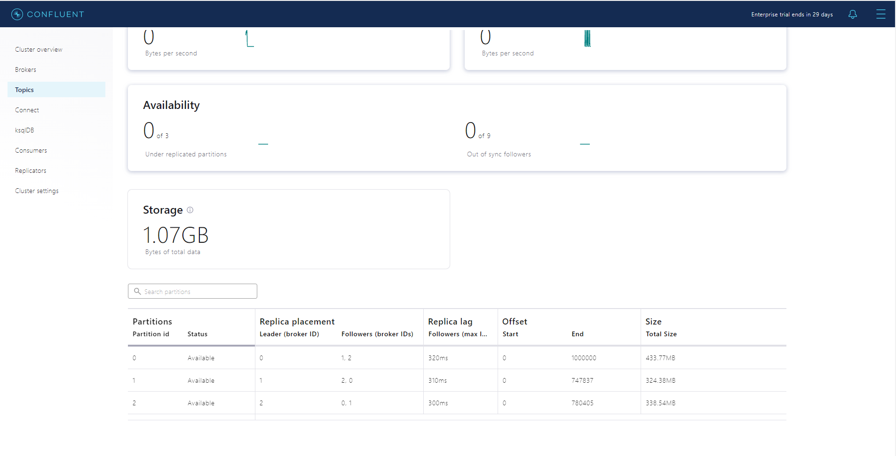
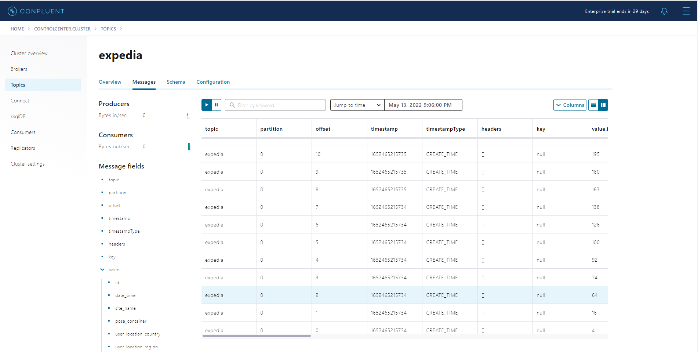

# Installation
```bash
git clone https://github.com/Vlad-Misiukevich/m11_kafkaconnect_json_azure.git
```
# Requirements
* Windows OS
* Python 3.8
* kubernetes-cli
* azure-cli
* terraform
# Description
1. Login to Azure:  
`az login`

2. Deploy infrastructure with terraform:  
`terraform init`  
`terraform plan -out terraform.plan`  
`terraform apply terraform.plan`

3. Connect to kubernetes cluster:  
```
az aks get-credentials \
    --resource-group rg-vmisiukevich-westeurope \
    --name aks-vmisiukevich-westeurope \
    --subscription 45a58420-2e1a-4ba1-b23b-c55612222ef5
```

4. Run the proxy for Kubernetes API server:  
`kubectl proxy`  
5. Build and push image to DockerHub:  

6. Create the namespace to use:  
`kubectl create namespace confluent` 

7. Set this namespace to default for your Kubernetes context:  
`kubectl config set-context --current --namespace confluent`  

8. Add the Confluent for Kubernetes Helm repository:  
`helm repo add confluentinc https://packages.confluent.io/helm`  
`helm repo update`

9. Install Confluent for Kubernetes:  
`helm upgrade --install confluent-operator confluentinc/confluent-for-kubernetes`

10. Install all Confluent Platform components:  
`kubectl apply -f ./confluent-platform.yaml`

11. Install a sample producer app and topic:  
`kubectl apply -f ./producer-app-data.yaml`

12. Check that everything is deployed:  
`kubectl get pods -o wide `

13. Set up port forwarding to Control Center web UI from local machine:  
`kubectl port-forward controlcenter-0 9021:9021`

14. Browse to Control Center:

15. Create a kafka topic in Control Center:

16. Set up port forwarding to connect cluster from local machine:  
`kubectl port-forward controlcenter-0 8083:8083`

17. Create connector and read data from storage container into Kafka topic:  
`curl.exe -d "@C:\Users\Uladzislau_Misiukevi\PycharmProjects\m11_kafkaconnect_json_azure\connectors\azure-sour
ce-cc-expedia.json" -H "Content-Type: application/json" -X POST http://localhost:8083/connectors`


18. Mask time from the date field to format "0000-00-00 00:00:00":

19. Result:

